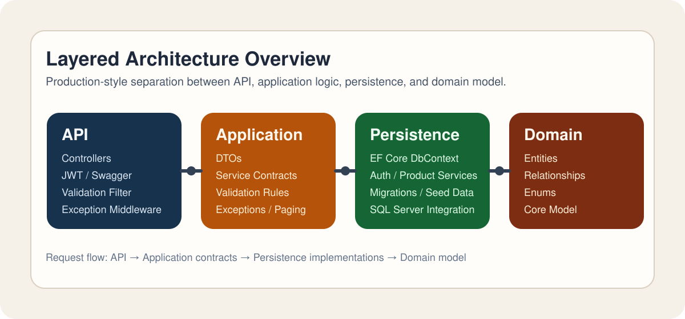

# E-Commerce Backend API

Production-style ASP.NET Core Web API project built with layered architecture, JWT authentication, refresh token flow, role-based authorization, product/category management, cart/order workflows, validation, centralized exception handling, Serilog logging, Docker support, and deployment-ready structure.

## Overview

This project simulates a real-world e-commerce backend rather than a tutorial-level CRUD API. It is designed to demonstrate how to structure a maintainable ASP.NET Core application with layered architecture, authentication, authorization, transactional order flow, and operational concerns such as logging, validation, and containerization.

## Features

- JWT authentication with register, login, refresh token, and logout
- Role-based authorization for `Admin` and `Customer`
- User profile and admin user management endpoints
- Category and product management for admin workflows
- Product listing with pagination, filtering, and sorting
- Cart operations and order creation from cart items
- Global exception handling middleware
- FluentValidation-based request validation
- Serilog request and error logging
- SQL Server + Entity Framework Core
- Dockerfile and `docker-compose` setup

## Architecture

The solution is split into four projects:

- `ECommerceAPI.API`: controllers, middleware, auth configuration, Swagger
- `ECommerceAPI.Application`: DTOs, interfaces, validation, mappings, exceptions
- `ECommerceAPI.Persistence`: `DbContext`, EF Core configuration, service implementations, seed data
- `ECommerceAPI.Domain`: entities and enums



## Project Structure

```text
ECommerceAPI.API
ECommerceAPI.Application
ECommerceAPI.Persistence
ECommerceAPI.Domain
docs/assets
```

- `ECommerceAPI.API`: HTTP layer, authentication setup, Swagger, middleware, filters
- `ECommerceAPI.Application`: use-case contracts, DTOs, validation rules, shared exceptions
- `ECommerceAPI.Persistence`: EF Core, SQL Server access, token handling, service implementations, migrations
- `ECommerceAPI.Domain`: core entities such as `User`, `Product`, `Cart`, `Order`, and supporting enums

## Security

- JWT bearer authentication for protected endpoints
- Refresh token flow with token revocation support
- Role-based authorization for `Admin` and `Customer`
- Password hashing via ASP.NET Core `PasswordHasher`
- Centralized validation and exception handling to reduce inconsistent controller logic

## Main Endpoints

### Auth

- `POST /api/auth/register`
- `POST /api/auth/login`
- `POST /api/auth/refresh-token`
- `POST /api/auth/logout`

### Users

- `GET /api/users/me`
- `GET /api/users`
- `PUT /api/users/{id}/role`

### Categories

- `GET /api/categories`
- `POST /api/categories`
- `PUT /api/categories/{id}`
- `DELETE /api/categories/{id}`

### Products

- `GET /api/products`
- `GET /api/products/{id}`
- `POST /api/products`
- `PUT /api/products/{id}`
- `DELETE /api/products/{id}`

### Cart

- `GET /api/cart`
- `POST /api/cart/items`
- `PUT /api/cart/items/{id}`
- `DELETE /api/cart/items/{id}`

### Orders

- `POST /api/orders`
- `GET /api/orders/my-orders`
- `GET /api/orders`
- `PUT /api/orders/{id}/status`

## Tech Stack

- ASP.NET Core Web API (.NET 9)
- Entity Framework Core
- SQL Server
- JWT Bearer Authentication
- FluentValidation
- Serilog
- Swagger / OpenAPI
- Docker

## Running Locally

### Option 1: Docker Compose

```bash
docker compose up --build
```

API will be available at `http://localhost:8080/swagger`.

### Option 2: Local SQL Server

1. Update `DefaultConnection` in `ECommerceAPI.API/appsettings.Development.json`.
2. Apply migrations:

```bash
dotnet ef database update --project ECommerceAPI.Persistence --startup-project ECommerceAPI.API
```

3. Run the API:

```bash
dotnet run --project ECommerceAPI.API
```

## Seeded Accounts

- Admin: `admin@ecommerce.local` / `Admin123!`
- Customer: `customer@ecommerce.local` / `Customer123!`

## Product Query Parameters

`GET /api/products` supports:

- `pageNumber`
- `pageSize`
- `search`
- `categoryId`
- `minPrice`
- `maxPrice`
- `sortBy` (`price`, `name`, `createdAt`)
- `descending` (`true`, `false`)

## Sample API Usage

Register a customer:

```bash
curl -X POST http://localhost:8080/api/auth/register \
  -H "Content-Type: application/json" \
  -d '{
    "fullName": "Jane Doe",
    "email": "jane@example.com",
    "password": "Secure123!"
  }'
```

Login and get JWT tokens:

```bash
curl -X POST http://localhost:8080/api/auth/login \
  -H "Content-Type: application/json" \
  -d '{
    "email": "admin@ecommerce.local",
    "password": "Admin123!"
  }'
```

Create a product as admin:

```bash
curl -X POST http://localhost:8080/api/products \
  -H "Authorization: Bearer <access-token>" \
  -H "Content-Type: application/json" \
  -d '{
    "name": "Noise Cancelling Headphones",
    "description": "Premium over-ear headphones for work sessions.",
    "price": 199.99,
    "stock": 12,
    "categoryId": "<category-id>"
  }'
```

## Design Notes

This project is intentionally structured to look and behave like a small real-world backend rather than a tutorial CRUD app. The goal is to demonstrate layered architecture, authentication/authorization, database design, validation, operational concerns, and recruiter-friendly project presentation in one repository.
